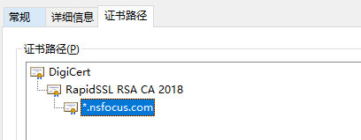

本文主要集中在实践上，将在代码层面上讲述如何获取证书链并解析证书中的信息。本文不会过多的讲解数字证书的一些理论和细节，只会点到即止。


java获取域名的证书链
---

```java
String domain = "nti.nsfocus.com";
URL url = new URL("https://" + domain);
HttpsURLConnection connection = (HttpsURLConnection) url.openConnection();

// connection.setSSLSocketFactory(trustSelfSignedSSLSockFactory);

// connection.setHostnameVerifier(org.apache.http.conn.ssl.SSLSocketFactory.ALLOW_ALL_HOSTNAME_VERIFIER);

//connection.setConnectTimeout(getTimeout() * 1000);
//connection.setReadTimeout(getReadTimeout() * 1000);
connection.connect();
Certificate[] certificates = connection.getServerCertificates();
```

如上所示就可以获取到nti.nsfocus.com的证书链，获取到的证书链第一个证书是网站网站的证书，后面的是CA的证书。获取到的顺序和下图正好是相反的，下图是nti.nsfocus.com的证书路径，最下面是`*.nsfocus.com`的证书，中间是`*.nsfocus.com`的办法机构的证书，第一个是root证书，root证书签发了RapidSSL的证书，也就是图中的第二个证书。

<!--  -->



java获取一个网站的证书过程和浏览器访问一个网站类似，会对网站证书进行合规性检查。比如这个网站的证书是否符合证书声明的dns域，或者证书是否过期。

下述代码声明了不检查证书的dns域是否合规。

```java
connection.setHostnameVerifier(org.apache.http.conn.ssl.SSLSocketFactory.ALLOW_ALL_HOSTNAME_VERIFIER);

//        <dependency>
//            <groupId>org.apache.httpcomponents</groupId>
//            <artifactId>httpclient</artifactId>
//            <version>4.5.12</version>
//        </dependency>
```

比如nti.nsfocus.com的证书dns域为`*.nsfocus.com`，表示所有nsfocus.com的子域名均可以使用。但是如果nsfocus.com.cn也是用这个域名chrome就会报警，同样我们上述的java代码也会抛出异常。

<!--  -->



同样，除了dns域的检查，java代码也会对证书的合法性进行验证，比如是不是可信CA签发的证书，是不是已经过期，不合法的情况也会抛出异常。下述代码可以让代码不进行这种检查，就是让代码接受所有的证书，无论是可信机构签发的证书，还是自签的证书，或者已经过期的证书，都会认为合法。

```java
import javax.net.ssl.*;
import java.security.GeneralSecurityException;

private static SSLSocketFactory getTrustSelfSignedSSLSockFactory() {
    TrustManager[] trustAllCerts = new TrustManager[]{
        new X509TrustManager() {
            public java.security.cert.X509Certificate[] getAcceptedIssuers() {
                return new X509Certificate[0];
            }

            public void checkClientTrusted(
                java.security.cert.X509Certificate[] certs, String authType) {
            }

            public void checkServerTrusted(
                java.security.cert.X509Certificate[] certs, String authType) {
            }
        }
    };

    // Install the all-trusting trust manager
    try {
        SSLContext sc = SSLContext.getInstance("SSL");
        sc.init(null, trustAllCerts, new java.security.SecureRandom());
        return sc.getSocketFactory();
    } catch (GeneralSecurityException ignored) {
    }
    return null;
}

private static SSLSocketFactory trustSelfSignedSSLSockFactory = getTrustSelfSignedSSLSockFactory();

connection.setSSLSocketFactory(trustSelfSignedSSLSockFactory);

```


提取转化数字证书中的信息
---


### 信息提取


`java.security.cert.X509Certificate`是java提供的证书类，我们使用上述代码获取的到的`Certificate`对象可以直接转换成该对象

```java
X509Certificate certificate = (X509Certificate) cert;
```

获取到这个`X509Certificate`对象后就可以利用他提供的解析方法提取其中的信息。`X509Certificate`提供了很多get方法来获取其中的信息，

```
X509Certificate certificate =  (X509Certificate) cert;

// 获取证书的生效时间和过期时间
certificate.getNotBefore();
certificate.getNotAfter();
// 数字证书的版本
certificate.getVersion();
// 证书的公钥
PublicKey publicKey = certificate.getPublicKey();
// 证书使用者的信息
X500Principal subjectX500Principal = certificate.getSubjectX500Principal()；
// 证书颁发者的信息
X500Principal issuerX500Principal = certificate.getIssuerX500Principal();
// subject alternative names 使用者可选名称，dns域就在其中
certificate.getSubjectAlternativeNames();

// 证书的编号，编号应以16进制进行编码，不舍弃前缀0。直接getSerialNumber()是一个大整数
byte2Hex(certificate.getSerialNumber().toByteArray());
```


### 证书颁发者和使用者的`X500Principal`数据解析。

```
LdapName ldapDN = null;
try {
    ldapDN = new LdapName(x500Principal.getName());
} catch (InvalidNameException e) {
    return null;
}
for (Rdn rdn : ldapDN.getRdns()) {
    switch (rdn.getType()) {
        case "C":
            // C表示country code，是国家的两个字母的缩写，比如中国是CN。注意：港澳台可能会编码成HK等省份名字，注意合规性检查。
            break;
        case "ST":
            // ST表示StateOrProvinceName 省份或者州的名字
            break;
        case "L":
            // L表示locality，地区，表示城市级的名字
            break;
        case "O":
            // organization，组织名称
            break;
        case "OU":
            // 组织中的哪个单位，一般没有，但是大公司会有，比如百度证书中OU为service operation department
            break;
        case "CN":
            // common name，通用名称。一般为网站的域名。
            break;
        default:
//          log.error("unknown subject rdn type {}", rdn.getType());
    }
}

```


### 使用者可选名称的解析。
```
Collection<List<?>> alternativeNames = certificate.getSubjectAlternativeNames();

for (List<?> name : alternativeNames) {
    // name 是 [one, two]这种形式，one是key，two是value
    if ("2".equals(String.valueOf(name.get(0)))) {
        // 2 表示dns, source code里面有解说
        String value = String.valueOf(name.get(1));
        // value就是dns域的其中一个值
    }
}
```


### 证书的指纹

windows平台展示证书信息中的指纹其实是证书sha1哈希值。除了sha1，其他哈希都可以算出来。计算证书的哈希要对其字节数组进行计算才可以。
```
byte[] certEncode = certificate.getEncoded();
```
对`certEncode`进行相应的哈希计算就可以得到证书的其他哈希值。


### 证书base64编码保存和解码

```
// java.util.Base64
public String encodeCertificate(Certificate certificate) {
    try {
        return new String(Base64.getEncoder().encode(certificate.getEncoded()));
    } catch (CertificateEncodingException ignored) {
    }
    return null;

}

public X509Certificate decodeCertificate(String certificate) {
    if (!isValid(certificate)) {
        return null;
    }
    try {
        // java.security.cert.CertificateFactory
        CertificateFactory fact = CertificateFactory.getInstance("X.509");
//            fact.generateCertificate(new ByteArrayInputStream(Base64.getDecoder().decode(cert.getBytes())));
        return (X509Certificate) fact.generateCertificate(new ByteArrayInputStream(Base64.getDecoder().decode(certificate)));
    } catch (CertificateException e) {
        e.printStackTrace();
    }
    return null;
}
```

